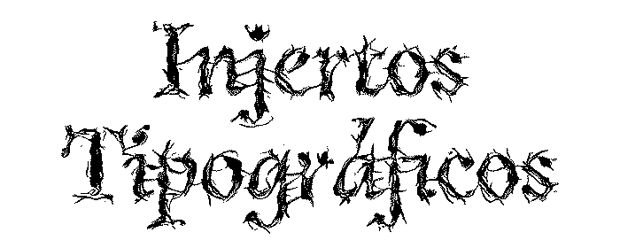

### Información
  - [Acerca del laboratorio](acerca)
  - [Publicación impresa](publicacion)
  - [Repositorio en GitHub](https://github.com/bejucoo/Injertos-Tipograficos)
  - [Evento de socialización](socializacion)
  - [Bibliografía y archivo audiovisual](archivo)
  - [Laboratorista: Pierre Puentes Gómez](participantes/pierre)
  
### Resultados de los participantes
  - [Annette Rodríguez Fiorillo](participantes/annette)
  - [Hugo Trujillo Martínez](participantes/hache)
  - [Io Salomé Agudo Angulo](participantes/salome)
  - [Isabella Viracachá López](participantes/isabella)
  - [Lina González Rodríguez](participantes/lina)
  - [María Rojas Muñoz](participantes/maria)
  - [Nathalia Cruz Sierra](participantes/nathalia)

&nbsp; 

